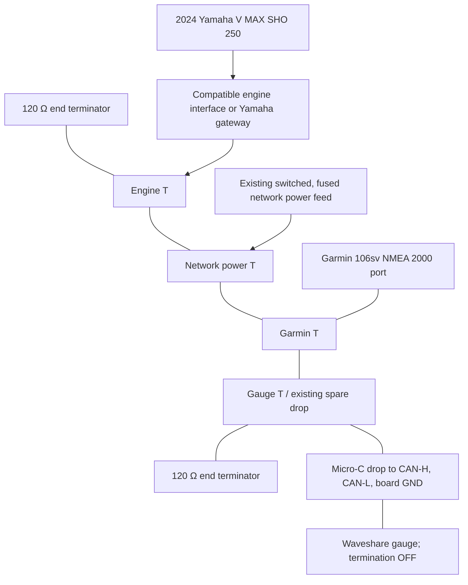
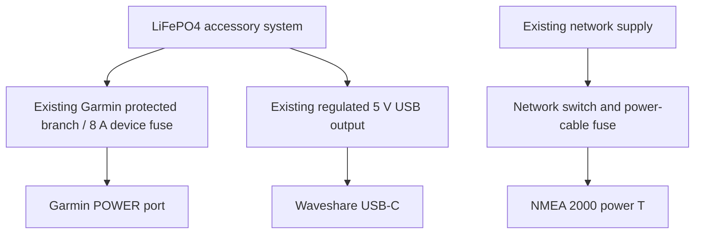

# V MAX Smart Gauge — Complete Boat Wiring Guide

Revision: 2026-10-07. Applies to the 2024 Yamaha V MAX SHO 250, Garmin 106sv, existing powered NMEA 2000 network, and Waveshare ESP32-S3-Touch-LCD-5 prototype.

## 1. Scope and installation status

This guide covers the engine data connection, Garmin GPS/chartplotter connection, backbone, network power, and custom gauge drop and power supply. Part numbers identify manufacturer parts; they do not imply that those exact parts are already installed on the boat.

The repository specifies an existing powered network and spare drop. Preserve the functioning Yamaha/Garmin installation and use that spare drop first. A new engine interface, network power cable, and terminators are only needed if missing or being replaced.

**Before purchasing an engine interface:** read the engine model/serial plate and identify the installed Yamaha harness and any Command Link/Command Link Plus hub or gateway. Neither its installed part number nor connector location has been recorded. The Lowrance compatibility list does not explicitly name the 2024 VF250; dealer confirmation is required for that exact motor and harness. This guide gives complete connection paths but is not an as-built record of uninspected hardware.

Prototype design retained from [Design Decisions](DECISIONS.md): separate regulated USB power from the LiFePO4 system, NET-S unused at the gauge, onboard CAN termination OFF, and receive-only firmware.

## 2. Complete data topology

The backbone is one continuous line. T sides carry the backbone; the branch/socket on each T is a device or power drop. T order below is illustrative; keep the installed order if it works.

Yamaha engine data and Garmin GPS data share the same backbone. There is no dedicated Garmin-to-gauge cable. The engine needs its compatible interface path even if the Garmin can already display some engine information over another connection.

## 3. Bill of materials and part numbers

### 3.1 Core network and gauge

| Item | Manufacturer / part number | System quantity | Purchase / use rule |
| --- | --- | ---: | --- |
| Gauge board | Waveshare **ESP32-S3-Touch-LCD-5**, SKU **28117** | 1 | 800 × 480 capacitive-touch model selected by this project. Do not substitute LCD-5B / SKU 28151 without firmware changes. [S1] |
| NMEA 2000 T | Garmin **010-11078-00** | 4 in illustrated layout | Engine, power, Garmin, gauge. Reuse installed Ts; gauge needs no additional T if the spare branch is free. [S3] |
| Short backbone/drop cable | Garmin **010-11076-03**, 0.3 m | As measured | Useful between nearby network components. [S3] |
| Backbone/drop cable | Garmin **010-11076-00**, 2 m | 1 for Garmin; 1 for gauge if making adapter | Reuse Garmin drop. For gauge, make a dedicated adapter as described in section 7. [S3] |
| Longer backbone/drop cable | Garmin **010-11076-04**, 4 m, or **010-11076-01**, 6 m | As measured | Use only when routing needs the length; total assembled drop must stay within the limit. [S3] |
| Backbone extension | Garmin **010-11076-02**, 10 m | Only if needed | Backbone only; do not use as a device drop. [S3] |
| Male end terminator | Garmin **010-11080-00** | 1 | Reuse existing. At backbone end, never on gauge branch. [S3] |
| Female end terminator | Garmin **010-11081-00** | 1 | Reuse existing. Exactly two total backbone terminators. [S3] |
| Network power cable | Garmin **010-11079-00**, 2 m, supplied 3 A fuse | 1 per unisolated powered segment | Reuse existing feed; do not install a second feed when adding gauge. [S3] |
| Male field-install connector | Garmin **010-11094-00** | Optional 1 | Alternative adapter construction; mates to standard female T branch. [S3, S4] |
| Female field-install connector | Garmin **010-11095-00** | Optional | For a mating device-side connector if required; not needed for direct pigtail to board. [S3, S4] |
| Network power isolator | Garmin **010-11580-00** | Conditional | Use only in a designed interface between separately powered network sections. It is not galvanic CAN isolation. [S3, S5] |

### 3.2 Engine interface — select one path, not both

| Engine installation | Manufacturer / part number | Quantity | Compatibility status |
| --- | --- | ---: | --- |
| Engine already supplies data to this NMEA 2000 backbone | Existing installed interface/gateway | 0 new | Record installed part number; verify engine PGNs on the actual backbone. |
| Compatible Yamaha engine with free engine data connector, without existing Command Link bus occupying it | Lowrance **000-0120-37**, 15 ft Yamaha Engine Interface Cable; T included | 1 if approved | Manufacturer lists supported Yamaha families, but not the exact 2024 VF250. Confirm model/serial/harness compatibility before ordering. [S6] |
| Installed Yamaha Command Link / Command Link Plus network | Yamaha **MAR-GTWAY-KT-20** gateway kit | 1 if approved and not already fitted | Listed in Yamaha's 2024 rigging catalog for Command Link / Command Link Plus. Confirm kit, required Yamaha connection leads, and any supersession for the boat's hub. [S7] |

Do not buy both interface paths or splice the proprietary Yamaha bus into a Micro-C cable. Hub pigtail lengths and part numbers depend on the installed Yamaha topology; they remain an inspection item, not a guessed purchase list.

### 3.3 Garmin and display power

| Item | Manufacturer / part number | Quantity | Use |
| --- | --- | ---: | --- |
| Garmin power/data lead | Garmin **010-12938-00**, threaded 4-pin lead for ECHOMAP Ultra | Reuse existing 1 | Applicable if the unit is the original ECHOMAP Ultra 106sv; verify rear product label. Retain the manufacturer's fuse. [S8, S9] |
| USB supply | Existing LiFePO4 regulated 5 V USB output | Reuse 1 output | Preferred prototype arrangement. Board power goes into USB-C. Battery itself is not a 5 V supply. |
| Optional replacement USB converter/socket | Blue Sea Systems **1016**, dual USB-A, 5 V, 2.1 A total | 1 only if existing USB output is inadequate | Install on LiFePO4 accessory branch; dedicate capacity to gauge during validation. [S10] |
| Optional converter fuse holder | Blue Sea Systems **5065**, waterproof ATO/ATC inline holder | 1 with converter | Fuse close to the positive source; use appropriate marine connections between its 12 AWG leads and branch wire. [S11] |
| Converter fuse | Blue Sea Systems **5236**, 2 A ATO/ATC | 1 with 1016 | Matches Blue Sea 1016 supply-fuse requirement. This is not the Garmin or network fuse. [S10, S12] |
| USB-A to USB-C cable | Board-supplied cable; otherwise rated data cable, ≥2 A | 1 | Data-capable cable permits flashing; choose length after routing. No cable SKU selected in this project. |
| Adapter consumables | Marine tinned wire, correctly sized ferrules, adhesive heat shrink, cable labels, supports, sealed gland | As measured | Match terminal capacity and actual cable outside diameter; no fixed gland/terminal SKU until enclosure dimensions are known. |

**Minimum addition to an already working boat:** one Waveshare board, one dedicated gauge Micro-C adapter/drop, and one USB cable/output. Add a T only if the spare drop is unavailable. All other parts are reuse, conditional replacement, or dependent on inspecting the installation.

## 4. Yamaha motor to NMEA 2000

### Path A — existing working engine connection

1. On the Garmin, verify that actual engine RPM appears with the engine running, and identify the NMEA 2000 engine/interface in the device list.
2. Trace the installed engine lead to its NMEA T or gateway. Record its label, part number, hub connections, and any power feed.
3. Leave this path in place. Engine data visible only through a separate engine/J1939 connection is not proof that it is present on NMEA 2000; confirm PGNs with the scanner.

### Path B — approved direct interface cable

1. Switch off engine ignition and network power before opening the cowling or changing connectors.
2. Identify the engine data connector using the exact VF250 rigging/service documentation. Have Yamaha verify that the connector is free and that **000-0120-37** is appropriate. Do not identify it solely by wire color, and do not use the diagnostic/service connector as a substitute.
3. Plug the approved interface into the engine data connector; retain its seal/locking mechanism. Route the intact cable through an approved engine rigging route, with slack for steering and tilt and no pinch points.
4. Connect its NMEA end to a device branch of the engine T. Include the full interface length plus any extension when measuring the drop. The nominal 15 ft cable is about 4.6 m, so adding a 2 m extension would exceed a 6 m drop.
5. Preserve both end terminators and the existing single network feed. Verify RPM after reassembly. Treat trim and other fields as available only after observing them; dealer work may be needed for digital trim. [S6]

### Path C — existing Command Link / Command Link Plus bus

1. Keep the Yamaha bus, Yamaha gauges, and Yamaha termination/power arrangement intact.
2. Use a dealer-confirmed **MAR-GTWAY-KT-20** kit and specified hub leads according to its instructions.
3. Connect the gateway's designated NMEA 2000 side to the standard backbone as the kit instructs. Do not treat the proprietary Yamaha-side lead as an ordinary Micro-C drop.
4. Identify whether the gateway/engine side contributes network power before retaining or adding a power feed. Where two feeds exist, design the power-isolated sections explicitly; do not join both positives blindly.
5. Confirm engine PGNs on the standard NMEA backbone. Record the actual connection as-built.

The exact Yamaha hub sockets and additional Yamaha harness part numbers must be taken from the installed hub and gateway-kit instructions. The repository does not establish them.

## 5. Garmin GPS/chartplotter to NMEA 2000

For the documented Garmin 106sv, this guide assumes the **ECHOMAP Ultra 106sv**. Verify the label before replacing its power lead.

1. Connect a standard Micro-C drop (**010-11076-00**, or existing suitable cable) between the Garmin cradle's port labeled **NMEA 2000** and its T branch. [S8]
2. Keep the separate Garmin power harness connected to the LiFePO4 accessory supply. Its red lead is positive and black lead is return; retain the specified **8 A fuse** for the original Ultra series and the installed source protection. [S8]
3. Do not connect the power/data lead's blue/brown NMEA 0183 wires to the white/blue NMEA 2000 CAN pair. They are different interfaces. Insulate unused wires individually.
4. Power the Garmin and the NMEA network. Obtain a GPS fix and check the NMEA 2000 device list and data-source settings in its current manual.
5. Use the scanner to verify **129026** traffic for speed/course. Look for **129025** and **129029** if position/fix data is needed. Seeing GPS values on the Garmin screen alone does not prove they are transmitted to the network.

The receive-only custom scanner does not send an address claim and should not be expected to appear as a normal named device in the Garmin device list.

## 6. Power arrangement

Keep these three loads/circuits distinct. A Garmin NMEA connection does not power its screen, and the gauge NET-S conductor does not power the Waveshare.

If installing Blue Sea **1016** instead of using an existing regulated output: accessory positive → **5065** holder with **5236** 2 A fuse → switch → charger positive; charger negative → accessory return. Use the charger's USB-A output with the gauge USB-C cable. Secure and protect the live USB connection inside a dry enclosure; its protective cap rating applies when closed, not when a cable is inserted. [S10–S12]

Use a stable 5 V supply with at least 1 A capacity; 2 A headroom is the project's preferred target. Validate at full brightness and during peak workload. Do not insert a 12 V LiFePO4 supply into USB-C or the board's small 3.7 V single-cell battery socket. Leave the board battery socket unused and its battery switch OFF for this USB prototype. Use one selected board power input at a time. [S1, S2]

The CAN transceiver shares board ground: separate USB power does **not** provide galvanic CAN isolation. NET-C connects to board GND. Preserve the network reference and do not create another shield bonding point at the gauge. Before attaching a separately powered laptop, review its ground connection; a battery-powered laptop is preferable for the first dockside diagnostic connection.

## 7. Micro-C drop to Waveshare — every conductor

### 7.1 Adapter construction

Use a dedicated Garmin **010-11076-00** cable as the adapter: preserve its **male** Micro-C end to mate with the normal **female T branch**, and remove the other/device end to make the board pigtail. This permanently modifies only the new adapter cable; leave installed cables intact. Alternatively, fit **010-11094-00** to suitable NMEA cable using Garmin's connector instructions. [S3, S4]

With all power disconnected, identify the connector's molded contact numbers and continuity-test each conductor. A mating-face view and a wire-entry view are mirrored; do not infer contact positions from an unlabeled sketch. The official Garmin drawing [S4] is the orientation reference.

| Micro-C contact | Standard conductor | NMEA name / function | Gauge-side destination |
| ---: | --- | --- | --- |
| 1 | Bare drain / shield | Cable shield | Keep cable shielding intact to the enclosure entry; individually insulate the drain at gauge end for this prototype. No connection to board GND, NET-C, or a new local earth bond. |
| 2 | Red | NET-S / network positive | **No connection.** Individually heat-shrink and secure. Network voltage may be present even while gauge USB is off. |
| 3 | Black | NET-C / network reference | Board logic/power **GND** terminal verified against schematic, e.g. I2C block GND adjacent to VOUT. Never use DI COM as CAN reference. |
| 4 | White | NET-H / CAN high | **CAN-H** terminal |
| 5 | Blue | NET-L / CAN low | **CAN-L** terminal |

Pin/color assignment: [S4]. Board signal mapping: [S2]. For a non-Garmin cable, test actual continuity rather than trusting its jacket or conductor colors.

### 7.2 Board connections and switches

Use terminal **labels**, not left-to-right positions. The published schematic has a P1 16-contact interface; the actual connector drawing and board revision control physical position. Photograph its labels before assembly.

| Waveshare connection | What to attach / set |
| --- | --- |
| CAN-H | White NET-H |
| CAN-L | Blue NET-L |
| Board GND on logic/power side | Black NET-C; verify continuity to the CAN transceiver ground while unpowered |
| USB-C | Regulated 5 V USB power |
| CAN 120 Ω switch | **OFF** for this drop |
| VIN, VOUT, SDA, SCL, RS485-A/B | No new connection for gauge networking; VOUT is not a power input |
| DI COM, DI0, DI1, DO0, DO1, isolated I/O return | Leave unused for initial network commissioning |
| Small single-cell battery connector | Unused |

CAN signals go through the **onboard TJA1051**, not directly to the ESP32 pins. Firmware uses **GPIO15 TX**, **GPIO16 RX**, **250 kbit/s**, **TWAI_MODE_LISTEN_ONLY**, and zero TX queue. No MCP2515, second transceiver, or jumper from Micro-C directly to GPIO15/16 is needed.

The board's isolated digital I/O does not make its CAN isolated. Do not confuse isolated I/O return with logic GND; confirm the exact revision's schematic and unpowered continuity before choosing a GND terminal.

Keep the CAN pair twisted close to the terminals, keep exposed untwisted tails short, use properly sized ferrules, and strain-relieve the cable jacket. Insulate red and shield separately. Do not tin stranded wire before clamping it in screw terminals.

## 8. Backbone checks

Retain a linear backbone and exactly two 120 Ω terminators. Use the spare T branch for the new gauge. If another T is needed, insert it in the backbone through its sides and restore the terminator at the new end. No terminator belongs inside the gauge or on its drop. [S5]

For Garmin micro-cable construction, each complete device drop is limited to **6 m**, combined drops to **78 m**, and the network path between its farthest points to **100 m**; count interface leads and extensions. Record the actual lengths. [S5]

The network power cable already installed remains the only power injection into its unisolated segment. Verify network voltage against connected-device requirements and inspect the engine/gateway power arrangement. An NMEA power isolator separates power feeds; it does not replace either CAN end terminator or isolate CAN electrically.

## 9. Installation and commissioning procedure

1. **Baseline:** photograph engine interface, Garmin ports, every T, power feed, and both terminators. Record Garmin GPS fix and existing engine readings before changes.
2. **Power off:** engine ignition, Garmin, network feed, and gauge USB. Verify no voltage before continuity or resistance tests.
3. **Identify parts:** confirm board SKU/revision, Garmin model, engine model/serial, and engine interface. Complete the as-built table in section 12.
4. **Make adapter:** verify all five connector contacts, connect white/blue/black as section 7 specifies, and insulate red/drain individually. Check for stray strands and cross-conductor shorts.
5. **Termination:** with the assembled backbone unpowered, measure NET-H to NET-L at a disconnected accessible drop. Target about **60 Ω** from two 120 Ω terminators in parallel. About 120 Ω suggests a missing terminator; about 40 Ω suggests a third. Device circuits can influence measurements: investigate rather than changing terminators blindly.
6. **Board drop check:** with gauge disconnected from backbone and USB off, verify its CAN termination is OFF. It should not introduce a 120 Ω shunt. Recheck assembled resistance after adding the gauge.
7. **Bench power:** power gauge from the selected USB source, verify stable startup/display, then power down before attaching the network adapter.
8. **Firmware:** build/flash the live scanner from `firmware/` using `pio run -e nmea-scanner -t upload`. Monitor with `pio device monitor -b 115200`; see [firmware guide](../firmware/README.md) for port/toolchain setup.
9. **Network first:** restore Garmin/network power with engine off. Confirm existing operation, then power gauge. Serial startup should say `CAN TX=GPIO15 RX=GPIO16, 250 kbit/s, LISTEN ONLY` and `CAN initialized`.
10. **GPS:** acquire a fix. Confirm frames increase, observe PGN 129026/source, and compare SOG after conversion (m/s × 2.236936 = mph). COG can be unavailable when stationary.
11. **Engine:** run dockside only with proper cooling and safe boat operation. Confirm 127488 RPM/trim and compare RPM with Garmin/Yamaha. Note 127489 presence separately; it is not decoded by current scanner.
12. **Reference stability:** verify Garmin/Yamaha still behave normally, gauge stays powered, and CAN bus/loss counters do not climb unexpectedly.
13. **Disconnect test:** switch gauge off and remove its drop, then verify original network operation. A custom gauge fault must not become a required link in the backbone.
14. **Restore/seal:** route, secure, seal, and label all wiring. Retain USB access for recovery. Save the capture and as-built measurements under `nmea/captures/` and `hardware/wiring/`.

Do not resistance-test an energized network or insert meter probes that spread connector contacts. Use a suitable breakout/adapter.

### Current firmware expectations

Checked against `firmware/platformio.ini`, `firmware/src/main.cpp`, and `firmware/include/Scanner.h` on main commit `0beb16f01c4b321120ad14e582441d50ae6d7459`:

| Target / PGN | Current behavior | Installation evidence |
| --- | --- | --- |
| `simulated-gauge` | Generated engine data; default build environment | Useful bench display check only; readings do not prove network reception |
| `nmea-scanner` | Live receive-only CAN with blue activity screen; serial snapshots every 5 seconds | Use for commissioning |
| 127488 | Decodes engine RPM and trim | Compare against engine displays |
| 129026 | Decodes GPS SOG and COG | Compare against Garmin |
| 127505 | Decodes fuel fluid-level fields when transmitted | Requires actual tank sender/interface; engine wiring alone does not add it |
| 127489, 129025, 129029 | Frames counted; no full decoding/reassembly implemented in current scanner | Record presence; do not expect live temperature, fuel-flow, hours, or GNSS fields from current decoder |

Counts are CAN **frames**, not necessarily complete NMEA messages. The scanner reports dynamic source addresses; do not hard-code the engine or GPS address from an example. The final engine-style live gauge remains a firmware integration task.

## 10. Optional audible buzzer

The repository plans an external active buzzer on DO0; the board contains no onboard buzzer. Leave this circuit out of initial network commissioning. Current scanner/gauge targets do not establish functioning audible engine warnings.

When implementing [Audible Warnings](Audible-Warnings.md), use a matched 5–12 V active buzzer below the project's 100 mA target, dedicated low-current fuse, DO0 switching, and the exact output-side return from the board schematic. The isolated output return is not DI COM and must not be assumed to be the CAN reference. Confirm off-state behavior during startup/reset/update before connection. No buzzer part number has been selected or validated; this is an optional open hardware item rather than a mandatory network component.

## 11. Troubleshooting and boat test

| Symptom | Check |
| --- | --- |
| Display works, no CAN frames | Live scanner target; network power; male drop at correct T branch; white/blue mapping; black reference; CAN pins/rate; board CAN switch OFF |
| Garmin loses data after adding gauge | Disconnect gauge; inspect swapped CAN wires, short/stray strand, incorrect ground, accidental red NET-S connection, extra termination; restore baseline |
| GPS appears on Garmin but no 129026 | Correct NMEA port/drop, GPS fix and configured source/output; observe PGNs with Garmin as the active GPS source |
| GPS frames present, engine absent | Ignition, installed interface/gateway compatibility, Yamaha bus connection, and actual NMEA output; preserve original harness |
| RPM present, trim unavailable | Yamaha digital-trim configuration/interface; do not bridge unidentified engine wires |
| 127489 present but no temperature/hours/fuel-flow output | Current decoder limitation; wiring may be functioning correctly |
| Resets/flicker | USB voltage at board under load, cable losses, source capacity, shared loads, loose USB plug |
| Errors/losses grow | Termination, reference, cable routing, noise, power, loose contacts; compare counters with/without gauge |
| Gauge absent from Garmin device list | Expected for current listen-only scanner; verify received frames instead |

Boat test after dockside checks:

- [ ] RPM and SOG agree with existing displays over idle and safe operating ranges.
- [ ] Steering/tilt do not pull, pinch, or chafe the engine/interface wiring.
- [ ] Display stays powered through engine start and changes in accessory loads.
- [ ] GPS/engine data loss is observed correctly in serial diagnostics; unavailable data is recorded rather than treated as a wiring failure.
- [ ] No abnormal Garmin/Yamaha behavior or increasing unexplained CAN errors.
- [ ] Gauge power-off/disconnect leaves the original network working.
- [ ] Connector/gland entries, USB support, terminal retention, and water paths inspected after operation.
- [ ] Existing Yamaha/Garmin instruments remain the reference for engine alarms until the custom warning implementation is validated.

## 12. As-built record — fill from the actual boat

| Field | Installed value / verification |
| --- | --- |
| Engine complete model / serial | 2024 V MAX SHO 250; exact suffix/serial: ____ |
| Garmin exact label / power lead | 106sv; family/lead label: ____ |
| Engine interface/gateway part number | ____ |
| Yamaha hub and required hub-lead part numbers | ____ / not applicable |
| Waveshare SKU / PCB revision | 28117 selected; fitted revision: ____ |
| CAN-H / CAN-L / GND terminal photos | ____ |
| Gauge drop part number and finished length | ____ |
| Garmin drop part number and length | ____ |
| Engine drop total length, including extensions | ____ |
| Backbone length / total drops | ____ / ____ |
| Network power source, feed part number, fuse | ____ |
| Power isolator and segment boundaries, if fitted | ____ / not applicable |
| Both terminator locations / part numbers | ____ |
| Unpowered CAN-H to CAN-L resistance before/after | ____ Ω / ____ Ω |
| Network voltage at farthest drop under load | ____ V |
| USB source / cable / loaded board voltage | ____ / ____ / ____ V |
| Firmware target / commit flashed | `nmea-scanner` / ____ |
| Engine and GPS PGNs / observed source addresses | ____ |
| Capture path / test date / installer | ____ |

## 13. Sources and related documents

Manufacturer references checked 2026-10-07. Product numbers are verified catalog identifiers; local stock, supersessions, and exact boat compatibility are separate checks. Circuit routing and adapter procedures are project engineering instructions derived from these references and the current repository.

- **S1:** [Waveshare board documentation, SKU and power specifications](https://docs.waveshare.com/ESP32-S3-Touch-LCD-5).
- **S2:** [Waveshare schematic, including CAN transceiver, GND and interface nets](https://files.waveshare.com/wiki/ESP32-S3-Touch-LCD-5/ESP32-S3-Touch-LCD-5-Sch.pdf); [resource index](https://docs.waveshare.com/ESP32-S3-Touch-LCD-5/Resources-And-Documents). Match the fitted PCB revision.
- **S3:** [Garmin NMEA 2000 component part-number table](https://www8.garmin.com/manuals/webhelp/GUID-1415AAD0-FE63-42A6-8F8D-DB713D616122/EN-US/GUID-615828B1-7687-41A8-B079-1A949B333E37.html).
- **S4:** [Garmin field-install connector wiring/orientation drawing](https://static.garmin.com/pumac/N2k_Field-install_Connector_Wiring_ML.pdf).
- **S5:** [Garmin NMEA 2000 technical reference: construction, power, termination and limits](https://www8.garmin.com/manuals/webhelp/GUID-1415AAD0-FE63-42A6-8F8D-DB713D616122/EN-US/Technical_Reference_for_Garmin_NMEA_2000_Products_EN-US.pdf).
- **S6:** [Lowrance 000-0120-37 manufacturer description and compatibility list](https://www.lowrance.com/lowrance/type/accessories/sensor-networking-accessories/yamaha-engine-interface-cbl---rd/).
- **S7:** [Yamaha 2024 Outboard Rigging and Parts catalog — MAR-GTWAY-KT-20](https://yamahaoutboards.com/getmedia/4f60050c-bcc0-406e-aa97-47d9c6bf5d4a/YAMAHA-MARINE-2024-MRP-Catalog-WEB.pdf). Part listing verified from manufacturer-indexed catalog excerpt; exact kit installation and 2024 VF250 fit are not established by that listing.
- **S8:** [Garmin original ECHOMAP Ultra installation instructions](https://www8.garmin.com/manuals/webhelp/GUID-7EC09750-0897-4743-9159-D226DE691962/EN-US/ECHOMAP_Ultra_Installation_EN-US.pdf).
- **S9:** [Garmin power-cable extension reference, ECHOMAP Ultra 010-12938-00](https://support.garmin.com/fr-CA/?faq=aLjDGPpDM47pHY7gcp8dk6).
- **S10:** [Blue Sea Systems 1016 USB converter/socket](https://www.bluesea.com/products/1016/12_24V_Dual_USB_2.1A_Charger).
- **S11:** [Blue Sea Systems 5065 fuse holder](https://www.bluesea.com/products/5065/Waterproof_In-Line_ATO_ATC_Fuse_holder).
- **S12:** [Blue Sea Systems 5236 2 A fuse](https://www.bluesea.com/products/5236/ATO___ATC_Fuse_-_2_Amp).

Related: [Prototype Wiring](Wiring.md), [Hardware](Hardware.md), [Power](Power.md), [NMEA Data Plan](NMEA2000.md), [Testing](Testing.md), [Enclosure](Enclosure.md), and [firmware setup](../firmware/README.md).
